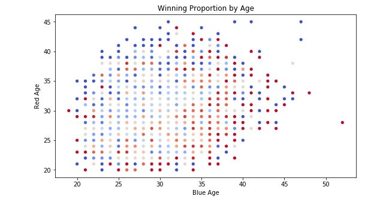
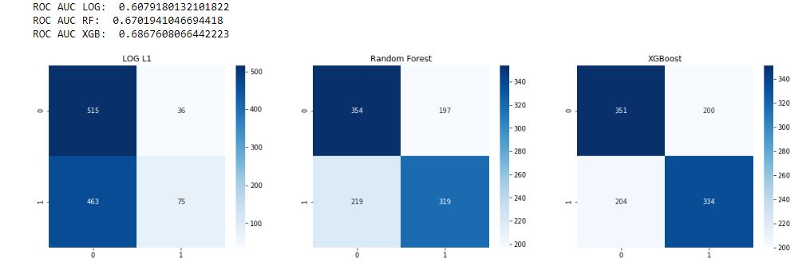
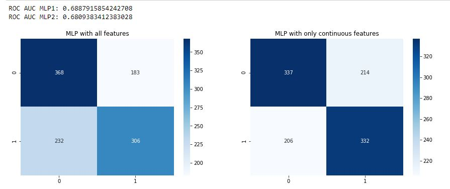

# UFC-Prediction

Web scraper with Python Requests and BeautifulSoup for http://www.ufcstats.com/statistics/events/completed.

Inspiration from Rajeev Warrier @: https://www.kaggle.com/rajeevw/ufcdata 
 
## Project includes:
1. Re-scrape UFC statistics: **Event_Details_Scrape.ipynb, Event_Scrape.ipynb, Fighter Info Scrape.ipynb**
2. Data cleaning & wrangling, feature engineering to generate relevant cumulative statistics: **Data Clean.ipynb**
3. EDA & Modeling: **UFC Exploratory Analysis.ipynb, Model.ipynb**
4. Fight Tracker for incoming predictions: **TBD**

## File Dictionary:
1. event_level_data.csv: summary statistics from general event page (ie. http://www.ufcstats.com/event-details/53278852bcd91e11)
2. fight_details_batch{i}.csv {i, 1..6}: detailed match statistics (in batches to lessen load on web server)
3. fighter.csv: physical attributes of individual fighters
4. fights.csv: personal checkpoint (combining a., b., c.)
5. unformatted_final --> model_data.csv (ready-to-model data)
6. to_model.csv: includes additional (optional) feature engineering

## Data Notes:
1. 'avg' statistics are on total/10 minutes of cumulative match time
2. 'cum' statistics are cumulative, not including the current match (except when it is the first match, otherwise, it is a wasted observation of 0's)
3. Missing heights/weights/reaches imputed using linear regression of physical traits < ~5% data

## To Use Scraper:
1. Event_Scrape: extracts summary stats of events (ie. http://www.ufcstats.com/event-details/53278852bcd91e11)
2. Event_Details_Scrape:  extracts detailed, fight-level statistics (ie. http://www.ufcstats.com/fight-details/e0b323dae5bf4c90)
3. Fighter_Info_Scrape: extracts physical attributes of fighters (ie. http://www.ufcstats.com/fighter-details/ee9ebceabfd16fa7)

For details, follow along with comments in code.

## Data Cleaning:
The data for this prediction model comes from http://www.ufcstats.com/statistics/events/completed, for fights from 1993 to the most recent fight (at this point March 14, 2020). I will be exploring prediction models for predicting a winner based on three broad categories: 
 1. A fighter's physical attributes & fighting style
 2. General information about the match: weight category, round duration
 3. Each fighter's cumulative statistics
 
## Exploratory Analysis & Feature Engineering:
I conducted exploratory data analysis with a couple of goals in mind:
 1. Validating assumptions about the relationships among features and labels
 2. Discovering new relationships among less interpretable features

Initial plots of weight, height, and reach confirm a relatively linear relationship. For the very few instances for which weight/height data was missing,  I imputed them using the population median (to avoid the effect of the few outliers). I imputed the missing reach values as a simple regression of height and weight. Since relative heights/weights/reaches will be similar across fights determined by a weight class, for the model, I replace these features with a single variable measuring physical differene between the fighters. 

Next, I tested one of initial hypothesis: younger fighters tend to defeat older fights:

. 

Each point defines all fights for a given age combination, with the intensity of the hue defining the  proportion of wins for that particular fighter. 

## Feature Engineering & Modeling:
As mentioned in the data dictionary, each observation consists of a fighter's cumulative statistics, excluding the current fight. These cumulative statistics transformed into measures of efficiency: cumulative statistics are divided by the average length of a match (10 minutes across the population); for hits and strikes, I use the fighters' cumulative efficiency (hits / attempts). 

Categorical variables like stance and weight class are one-hot-encoded. Before modeling the data, some models (ie. L1 penalty, neural networks) perform better with scaled data. We will look at models that do not require scaling first:

 1. **Random Forest:**
 I ran a gridsearch RandomForest Classifer across a variety of max feature counts. Intuitively, there is a similarity or connection among a fighter's statistics; by using less than the max number of the features, I want assess if there might be some redundancy or irrelevancy among the features. The gridsearch, however returned an optimal classifier using 100 features. Age and strikes hit (and strikes to head) were the most significant features. 
 
 2. **XGBoost:**
 Another tree based model that does not require feature scaling. This model ran the fastest, and was utlimately the best performing machine learning model. The gridsearch CV model determined returned an optimal step size (eta) of .05, reinforcing the complexity fo the model. 
 
 3. **Logistic L1/L2 Regression:**
 Since regularized models penalize feature size, feature scaling can influence the performance of the model. Therefore, before I ran the model, I transformed the features using scikit-learn's Standard Scalar. To ensure minimal information leak, I fit the transformer on the training set and applied this transformation on the test data. The performance on this model, however, could not compare to the ensemble models. 
 
 

 4. **Blended Model:**
 Next, I combined predictions from all three models into a blended logistic model. I hoped this might allow classification errors by one model to be covered by the other. Unfortunately, I do not think there are enough observations/data to adequately train such a model. This model underperformed the individual models.
 
## Deep Learning:
Finally, I employed a basic, single-layer MLP to capture additionally nonlinearities and hidden significance in the features. I tried 2 versions of the model, one with all features, and one with only the continuous variables. Performance across models was comparable. 

## Conclusion:
I will compare the predictions from XGBoost and the SL-MLP models going forward. Let's see how well the models predict the upcoming fights, April 15th!

